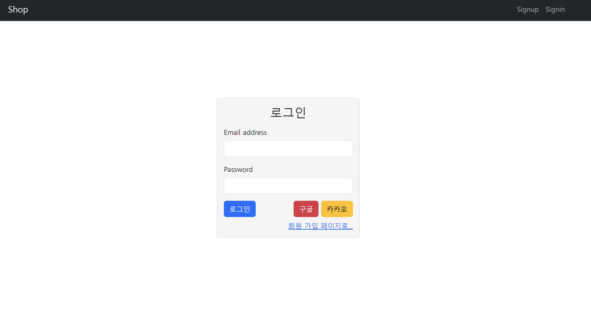
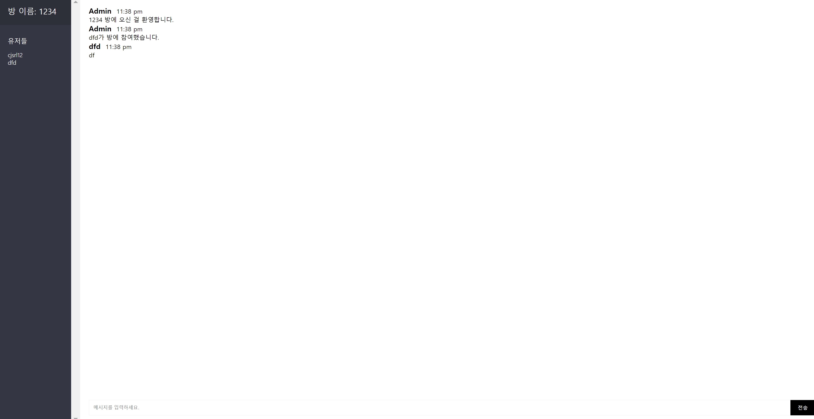
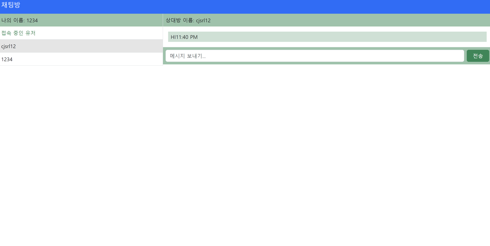
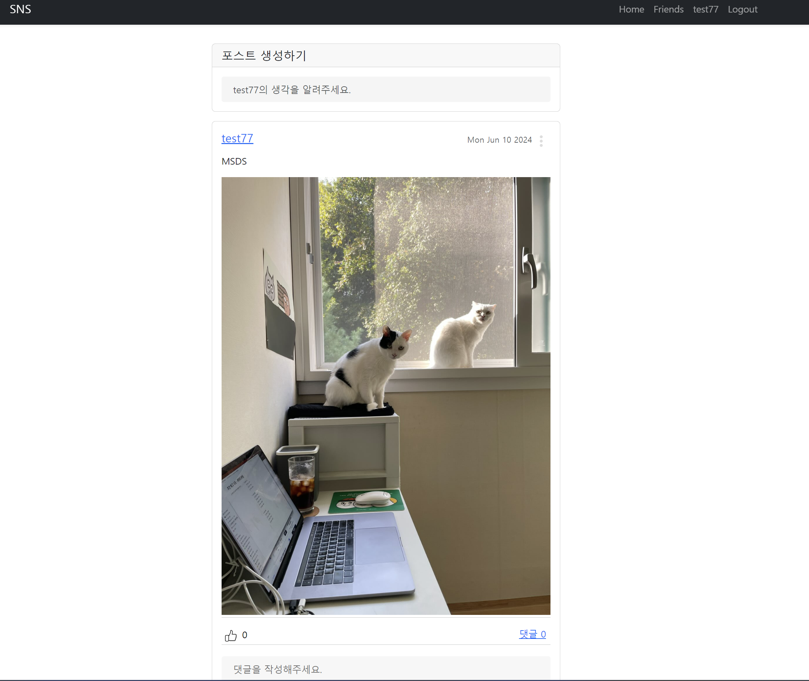
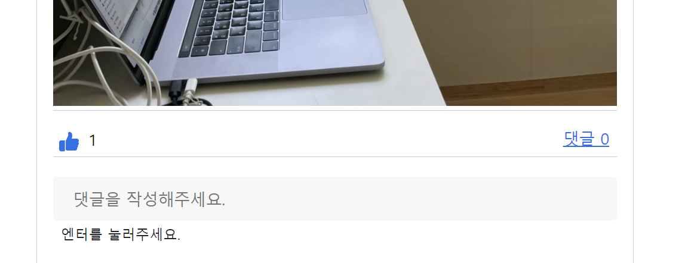

## 프로젝트 설명
이 프로젝트는 다양한 SNS 기능을 구현한 Node.js 기반의 웹 애플리케이션입니다. 주요 기능은 다음과 같습니다:

- **소셜 로그인**: 구글 및 카카오 계정을 사용하여 로그인할 수 있습니다.
- **실시간 채팅**: 사용자가 실시간으로 메시지를 주고받을 수 있습니다.
- **1대1 채팅**: 특정 사용자와 1대1로 채팅을 할 수 있습니다.
- **포스트 작성 및 관리**: 사용자가 글을 작성하고 관리할 수 있습니다.
- **댓글 작성 및 관리**: 포스트에 댓글을 달고 관리할 수 있습니다.
- **좋아요 기능**: 포스트와 댓글에 좋아요를 누를 수 있습니다.

---

## 기능 설명

### 소셜 로그인
구글 및 카카오 계정을 사용하여 간편하게 로그인할 수 있는 기능입니다. OAuth 2.0을 사용하여 구현되었습니다.

### 실시간 채팅
사용자가 실시간으로 메시지를 주고받을 수 있는 기능입니다. Socket.io를 사용하여 구현되었습니다.

### 1대1 채팅
특정 사용자와 1대1로 비공개 채팅을 할 수 있는 기능입니다. 개인적인 대화를 할 수 있도록 설계되었습니다.

### 포스트 작성 및 관리
사용자가 글을 작성하고, 수정하고, 삭제할 수 있는 기능입니다. 마크다운을 지원하여 다양한 형식으로 글을 작성할 수 있습니다.

### 댓글 작성 및 관리
포스트에 댓글을 달고, 수정하고, 삭제할 수 있는 기능입니다. 포스트에 대한 의견을 나눌 수 있습니다.

